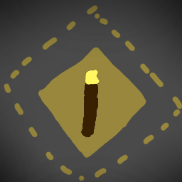

# DarkerLightSrc

---

A simple mod that makes various light sources darker.
This mod is meant to be used with mods that provide light sources requiring some sort of energy, such as [Create: Power Grid](https://modrinth.com/mod/power-grid).

Very much incomplete and is mostly a proof of concept of sorts.
Currently, the rules are hardcoded, but a config system will be implemented.

## Planned Features

Not sure how actively I will be working on this mod.

- Configurable overrides.
- Option to keep the light source's original texture brightness. (i.e. torch appears bright even though it does not propagate a bright light)

## Compatibility

Rules have been added for:

- [Create: Power Grid](https://modrinth.com/mod/power-grid) (brightness unchanged)
- [Create Crafts & Additions](https://modrinth.com/mod/createaddition) (brightness unchanged)
- [Hardcore Torches](https://modrinth.com/mod/hardcore-torches)

I plan to add support for more mods as I come across them.

## Building (todo)

Open a shell on the project directory and run `./gradlew build` on Mac & Linux, or `gradlew.bat build` on Windows.

You can find the emitted JARs in `fabric/build/libs/` and `neoforge/build/libs/`.
